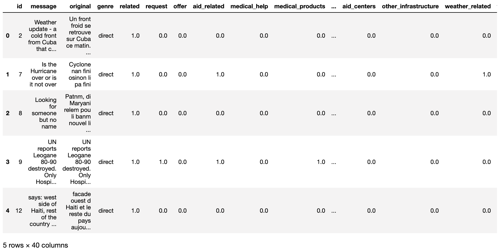

# Disaster Response Pipeline Project
### Table of Contents

1. [Installation](#installation)
2. [Project Motivation](#motivation)
3. [File Descriptions](#files)
4. [Deploy](#results)
5. [Licensing, Authors, and Acknowledgements](#licensing)

## Installation <a name="installation"></a>

The code should run with no issues using Python versions 3.*.

[Installing Flask](https://flask.palletsprojects.com/en/1.1.x/installation/#install-flask)
```
$ pip install Flask
```

[Installing scikit-learn](https://scikit-learn.org/stable/install.html)
```
pip install -U scikit-learn
```

## Project Motivation<a name="motivation"></a>

Folloing a disaster, typically there are millions and millions of communications either direct or via social media right at the time, When disaster response organizations have the least capacity to filter and then pull out the messages which are the most import. Usually different organizations will take care of different parts of the problem about water, blocked roads, medical supplies so on. So this classification problem is a type of supervised machine learning. 

In this project I build an ETL Pipeline to repair the disasters dataset and an Machine Learning Pipeline to classifies disaster messages. Hence,the web app would be to categorize these messages into 36 categories,so that it can be understood what type of aid is necessary for a specific disaster.

### Dataset

The [Figure Eight (appen)](https://appen.com/) are providing pre-labeled tweets and text messages from real life disasters. 

<div align="center">

</div>
<div align="center">
<u> **Messages** </u>
</div>


### Web UI
 An emergency worker can input a new message and get classification results in several categories. The web app will also display visualizations of the data.
<div align="center">

</div>
<div align="center">
<u> **Web Application** </u>
</div>

## File Descriptions <a name="files"></a>
```
- app
| - template
| |- master.html  # main page of web app
| |- go.html  # classification result page of web app
|- run.py  # Flask file that runs app

- data
|- disaster_categories.csv  # data to process 
|- disaster_messages.csv  # data to process
|- process_data.py
|- InsertDatabaseName.db   # database to save clean data to

- models
|- train_classifier.py
|- classifier.pkl  # saved model 

- README.md
```
## Deploy <a name="results"></a>

1. Run the following commands in the project's root directory to set up your database and model.

    - To run ETL pipeline that cleans data and stores in database
    ```
        python data/process_data.py data/disaster_messages.csv data/disaster_categories.csv data/DisasterResponse.db
    ```
    - To run ML pipeline that trains classifier and saves
    ```
        python models/train_classifier.py data/DisasterResponse.db models/classifier.pkl
    ```
2. Run the following command in the app's directory to run your web app.
    ```
        python run.py
    ```
3. Go to http://0.0.0.0:3001/


## Licensing, Authors, and Acknowledgements <a name="licensing"></a>

### Built With

* [Pandas](https://pandas.pydata.org/) - pandas is a fast, powerful, flexible and easy to use open source data analysis and manipulation tool.
* [Flask](https://palletsprojects.com/p/flask/) - Flask is a lightweight WSGI web application framework.
* [scikit-learn](https://scikit-learn.org) - scikit-learn is a Python module for machine learning built on top of SciPy.
* [NLTK](https://www.nltk.org/) - NLTK is a leading platform for building Python programs to work with human language data.

### Versioning

* We use [SemVer](http://semver.org/) for versioning. For the versions available, see the [tags on this repository](https://github.com/your/project/tags).

### Authors

* **Tom Ge** - *Fullstack egineer* - [github profile](https://github.com/tomgtqq)

### License

* This project is licensed under the MIT License